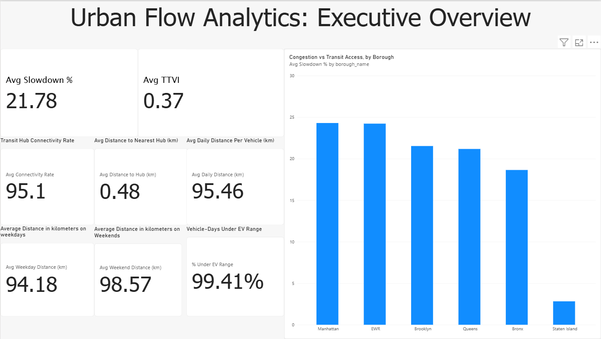
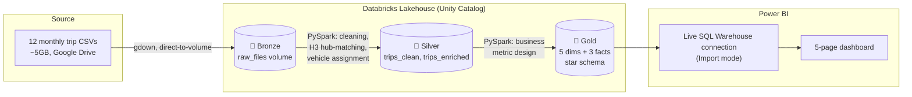

# 🚕 Urban Flow Analytics

**An end-to-end data engineering + BI project analyzing 12 months of NYC-style taxi trip data to surface congestion, transit-equity, and fleet-decarbonization insights.**


Built for **DATATHON 2026** — an industrial-style ELT pipeline (Bronze → Silver → Gold) on Databricks, feeding a 5-page interactive Power BI dashboard connected live via a Databricks SQL Warehouse.

---

## 📊 The Dashboard



Three business questions drive the whole project:

| Area | Key Metrics |
|---|---|
| 🚦 **Congestion & Bottleneck Analysis** | Travel Time Variability Index (TTVI), Congestion Slowdown % |
| 🚉 **First-/Last-Mile Transit Integration** | Transit Hub Connectivity Rate, Avg. Distance to Nearest Hub |
| 🔋 **Fleet Decarbonization & EV Readiness** | Avg. Daily Distance per Vehicle, % Vehicle-Days under EV Range |

See all 5 dashboard pages in [`reports/screenshots/`](reports/screenshots/).

---

## 🏗️ Architecture



## 📁 Repository Structure

```
urban-flow-analytics/
├── README.md              ← you are here
├── DATASET.md              ← source data, schema, scale, known data-quality caveats
├── WALKTHROUGH.md           ← the build story, chronologically, bugs and all
├── TECHNIQUES.md            ← the data engineering & BI techniques used, explained
├── notebooks/                ← Databricks notebooks (01 → 04, Bronze to Gold)
└── reports/
    └── screenshots/          ← all 5 dashboard pages, exported as PNG
```

## 🧰 Tech Stack

- **Compute:** Databricks (Free Edition), PySpark, Spark SQL
- **Storage:** Delta Lake, Unity Catalog (bronze / silver / gold schemas)
- **Geospatial:** Uber H3 hierarchical geohashing (resolution 8, k-ring search)
- **BI:** Power BI Desktop, live Databricks SQL Warehouse connector, DAX

## 📖 Read More

- **[DATASET.md](DATASET.md)** — where the data came from, what's in it, and what's wrong with it (documented honestly)
- **[WALKTHROUGH.md](WALKTHROUGH.md)** — the full build narrative: decisions, dead ends, and fixes
- **[TECHNIQUES.md](TECHNIQUES.md)** — deep dives into the engineering techniques: medallion architecture, H3 geohashing, dimensional modeling, and the Power BI/DAX patterns used

## 👤 Author

**Nandun Neelaka Samarasekara**
[GitHub](https://github.com/NandunSamarasekara) · [LinkedIn](https://www.linkedin.com/in/nandun-samarasekara-5564162b8/) · [Medium](https://medium.com/@nandunneelaka)

